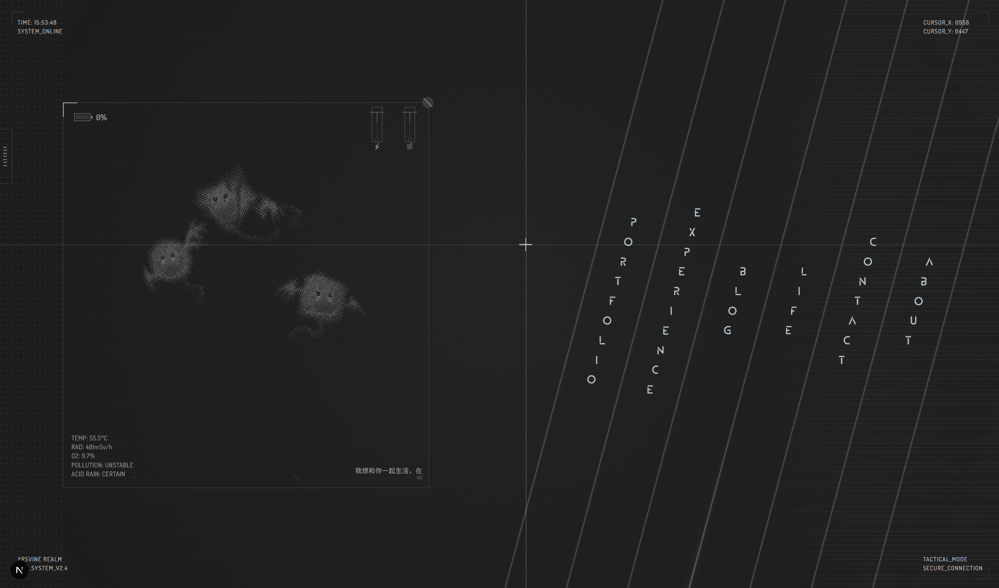

**中文** | [English](./README.en.md)

# ARSVINE REALM

ARSVINE REALM 是一个个人作品集与博客站点，基于后末日科幻 HUD 视觉语言构建。站点用于展示项目作品、经历、生活记录、博客文章、友情链接与联系方式，同时保留实时访客统计、音乐播放器、页面转场、WebGL/Three.js 氛围效果等交互能力。



## 项目状态

- **项目性质**：个人站点
- **站点名称**：`ARSVINE REALM`。
- **作者**：`Arsvine Zhu`。
- **技术基线**：Next.js 16 Pages Router、React 18、TypeScript、SCSS Modules、Three.js、GSAP、MDX、自定义 Node.js server。
- **运行要求**：Node.js `22.x`（与 Vercel 默认 LTS 一致；本地 Node 20.9+ 仍可运行，仅作为兼容下限）。
- **测试状态**：当前没有配置测试框架，也没有 `test` script；可用校验为 `npm run lint` 与 `npm run build`。

## 功能概览

- **HUD 风格首页**：五列导航入口，进入 works、experience、blog、life、contact/about 等内容区。
- **动画页面转场**：通过 `TransitionContext` 统一处理页面切换，导航应使用 `useTransition().navigateTo()`，避免直接 `router.push()` 破坏转场。
- **内容聚合页**：`/content` 将主要内容以 hash 分区方式集中展示。
- **作品详情页**：`/web/[id]` 支持图文详情、Markdown 风格链接、Bilibili/GitHub 图标链接，以及从 `data/projects.ts` 配置的可复制关键词。
- **生活详情页**：`/life/[slug]` 展示 life 数据条目的详情内容。
- **MDX 博客**：`content/blog/*.mdx` 通过 frontmatter 生成博客列表、详情页、RSS 与 sitemap。
- **音乐播放器**：播放列表集中在 `data/music.ts`，音频文件放在 `public/music/`，支持浏览器原生 `<audio>` 可解码的格式，例如 `.mp3`、`.m4a`、`.flac`、`.wav`、`.ogg`。
- **实时统计**：自定义 `server.js` 提供 `/api/sse/stats` 与 `/api/stats`，统计在线人数、总访问量与累计运行时间。
- **一言代理**：`/api/hitokoto` 服务端代理 `v1.hitokoto.cn`，进程内 60s 缓存、5s 超时；首页打字机会以「1 轮预设 + 1 句一言」交替循环。
- **版权与许可页**：`/copyright`（双语展示源码 MIT、内容 CC BY-NC-ND 4.0）；`/license` 永久重定向到 `/copyright`。
- **SEO / 订阅文件**：`/sitemap.xml`、`/rss.xml`、`/robots.txt` 根据站点配置动态生成。
- **桌面 3D 效果**：`RainMorimeEffect` 与 `TesseractExperience`（基于 `@react-three/cannon` 物理引擎）通过 dynamic import 禁用 SSR，仅在客户端运行。

## 快速开始

```bash
npm install
cp .env.example .env.local
npm run dev
```

打开 `http://localhost:3000`。

> 注意：开发和生产都使用自定义 `server.js`。不要把启动方式替换成 `next dev` 或 `next start`，否则 SSE 统计系统不会按当前设计运行。

## 常用命令

```bash
npm run dev      # 启动自定义开发服务器：node server.js
npm run build    # 生产构建：next build
npm start        # 生产服务器：cross-env NODE_ENV=production node server.js
npm run lint     # ESLint flat config：eslint .
```

## 配置与内容维护

当前项目已经把常改内容尽量集中到配置和数据文件中，日常维护优先修改 `data/`、`content/`、`public/` 与环境变量，而不是直接改组件逻辑。

### 站点配置

`data/site.ts` 是站点级配置的主要入口，包含：

- 站点名称、作者、邮箱、版权起始年份
- `metaTitle`、`metaDescription`、RSS 描述
- 首页打字机签名（与一言交替循环显示）
- 社交链接
- favicon、Open Graph image、Twitter image
- Google Fonts / preconnect
- `htmlLang`、`og:locale`、RSS language
- `/content`、`/friends`、`/copyright` 的页面级 SEO 与标题文案

如果需要让 sitemap、RSS、robots、Open Graph 使用正式域名，请设置：

```env
NEXT_PUBLIC_SITE_URL=https://你的域名
```

也可以在 `data/site.ts` 的 `url` 中设置默认值；环境变量优先级更高。

### 内容数据

| 文件 | 用途 |
|---|---|
| `data/projects.ts` | 项目 / 作品数据，以及详情页可复制关键词 `copyableTokens` |
| `data/experience.ts` | 教育、工作、经历时间线 |
| `data/life.ts` | 游戏、旅行、生活内容，以及 Life 区部分可配置文案 |
| `data/skills.ts` | 技能树 |
| `data/friendLinks.ts` | 友情链接 |
| `data/music.ts` | 音乐播放器播放列表 |
| `data/site.ts` | 站点级身份、SEO、字体、locale 与资源配置 |

### 博客文章

在 `content/blog/` 中新增 `.mdx` 文件：

```mdx
---
title: "文章标题"
date: "2026-01-01"
excerpt: "一段简短摘要"
tags: ["tag-a", "tag-b"]
---

正文使用 Markdown / MDX 编写。
```

博客系统会读取 frontmatter 并生成：

- `/blog` 列表
- `/blog/[slug]` 详情页
- `/rss.xml`
- `/sitemap.xml`

### 音乐播放器

播放列表位于 `data/music.ts`：

```ts
export const musicPlaylist = [
  {
    title: 'Song Title',
    artist: 'Artist Name',
    src: '/music/example.m4a',
  },
];
```

音频文件托管在**腾讯云 COS**（香港 Bucket `arsvine-cdn`，地域 `ap-hongkong`，公有读私有写），生产通过 `cdn.arsvine.com` 子域直出（DNSPod CNAME → COS 源站，不经腾讯云 CDN）。`data/music.ts` 会用 `NEXT_PUBLIC_MEDIA_CDN` 作为前缀拼出最终 `src`：

```env
NEXT_PUBLIC_MEDIA_CDN=https://cdn.arsvine.com
```

环境变量**未设置**时（默认本地 dev），`src` 退回到 `/music/<文件名>`，从 `public/music/` 读取本地文件 —— 把同名音频拖进 `public/music/` 即可离线测试。

当前播放器基于 HTML5 `<audio>`，格式支持取决于浏览器解码能力；现代浏览器通常支持 `.m4a` / AAC。

> 音频文件通常较大，已按项目约定不纳入 Git 跟踪；`public/music/README.md` 保留了该目录的用途说明。

### 图片远程域名

Next.js `<Image>` 的远程图片白名单集中在：

```text
config/image-hosts.js
```

新增图床或 CDN 域名时，只改这个文件，然后重启 dev server / 重新构建。当前默认放行 `cdn.arsvine.com`（自有图床，腾讯云 COS 香港 Bucket）、`placehold.co`（占位图）以及 `images.unsplash.com` / `source.unsplash.com`（模板示例）。

> 文章 / 内容图片建议走 `next/image` + `unoptimized={true}` 直链 `cdn.arsvine.com`，绕开 Vercel Hobby 的 Image Optimization 配额（1000 张/月），同时避免被 `/_next/image` 二次抓取触发 COS 出站流量。COS 流量包不是限额器，10GB 用完会按量计费，记得到费用中心配预算告警。

### 统计数据

`server.js` 会把统计数据写入项目根目录的 `.stats.json`。如果部署环境不适合向项目目录写文件，可以设置：

```env
STATS_FILE=/var/lib/portfolio/stats.json
```

相关接口：

- `GET /api/stats`：返回累计运行时间与总访问量
- `GET /api/sse/stats`：SSE 推送在线人数与总访问量
- `GET /api/hitokoto`：服务端代理 `v1.hitokoto.cn`，返回 `{ text }`；进程内 60s 缓存，5s 超时；上游失败时返回 `502 { error: 'upstream_unavailable' }`

## 环境变量

见 `.env.example`：

```env
PORT=3000
NEXT_PUBLIC_SITE_URL=https://example.com
# NEXT_PUBLIC_UMAMI_SRC=https://cloud.umami.is/script.js
# NEXT_PUBLIC_UMAMI_WEBSITE_ID=your-website-id
# NEXT_PUBLIC_UMAMI_DOMAINS=your-domain.com,www.your-domain.com
# NEXT_PUBLIC_MEDIA_CDN=https://cdn.arsvine.com
# STATS_FILE=/var/lib/portfolio/stats.json
```

说明：

- `PORT`：自定义 server 监听端口，默认 `3000`。
- `NEXT_PUBLIC_SITE_URL`：用于 sitemap、RSS、robots、Open Graph URL。
- `NEXT_PUBLIC_UMAMI_SRC` / `NEXT_PUBLIC_UMAMI_WEBSITE_ID`：可选 Umami 统计脚本配置；仅当 `SRC` 存在时才注入 `<script>`。脚本注入位置在 `pages/_document.tsx`，固定附带 `defer` / `data-do-not-track="true"` / `data-exclude-search="true"`。
- `NEXT_PUBLIC_UMAMI_DOMAINS`：可选，逗号分隔的域名白名单（不带协议）。设置后 Umami tracker 只在这些域名下上报，`localhost` 与 Vercel preview 自动跳过，避免污染统计。
- `NEXT_PUBLIC_MEDIA_CDN`：可选，媒体 CDN base URL（如 `https://cdn.arsvine.com`，背后是腾讯云 COS 香港 Bucket `arsvine-cdn`）。由 `data/music.ts` 消费；未设置时音乐播放器从 `/public/music/` 读取本地文件。
- `STATS_FILE`：服务端统计持久化文件路径；不设置则使用项目根目录 `.stats.json`。

### Umami 事件埋点（可选）

注入脚本后页面浏览（pageview）会自动统计。若需要记录自定义事件，直接在元素上加 `data-umami-event` 属性即可，无需写 JS：

```tsx
<a
  href={siteConfig.social.github}
  data-umami-event="Click Social"
  data-umami-event-platform="github"
>
  GitHub
</a>
```

也可以在脚本里手动调用：

```ts
window.umami?.track('Open Life Item', { item: 'arknights' });
```

事件名长度上限 50 字符；属性是任意键值。本仓库未在组件中预置任何事件标签，按需追加即可。

## 路由结构

| 路由 | 说明 |
|---|---|
| `/` | 首页五列导航 |
| `/content` | 聚合内容页，支持 `#works`、`#experience`、`#blog`、`#life` 等 hash |
| `/works` | 作品分区页 |
| `/experience` | 经历分区页 |
| `/life` | 生活分区页 |
| `/blog` | 博客列表 |
| `/web/[id]` | 作品详情 |
| `/life/[slug]` | 生活详情 |
| `/blog/[slug]` | MDX 博客详情 |
| `/friends` | 友情链接 |
| `/about` | 关于页 |
| `/contact` | 联系页 |
| `/copyright` | 版权与许可（双语展示源码 MIT、内容 CC BY-NC-ND 4.0） |
| `/license` | 永久重定向到 `/copyright` |
| `/sitemap.xml` | 自动生成 sitemap |
| `/rss.xml` | 自动生成 RSS |
| `/robots.txt` | 动态生成 robots |

## 项目结构

```text
├── components/          # 页面组件、布局、交互组件、视觉效果
├── config/              # Next.js 等运行配置的外置片段
├── contexts/            # AppContext / TransitionContext
├── content/blog/        # MDX 博客内容
├── data/                # 站点配置与内容数据
├── hooks/               # 自定义 hooks
├── lib/                 # 博客解析等工具逻辑
├── pages/               # Next.js Pages Router 页面
├── public/              # 静态资源、图片、音乐目录
├── styles/              # SCSS Modules 与共享 partials
├── types/               # TypeScript 类型定义
└── server.js            # 自定义 Next.js + SSE server
```

## 技术栈

- Next.js 16（Pages Router）
- React 18
- TypeScript
- SCSS Modules / Sass
- Three.js / `@react-three/fiber` / `@react-three/drei`
- `@react-three/cannon` + `cannon-es`（Tesseract 物理模拟）
- GSAP
- MDX / `next-mdx-remote`
- Node.js custom server + SSE
- ESLint flat config + `eslint-config-next/core-web-vitals`

## 开发注意事项

- 项目使用 Pages Router，不使用 App Router。
- `server.js` 是运行入口；不要改成 `next dev` / `next start`。
- 全局状态主要来自 `contexts/AppContext.tsx` 与 `contexts/TransitionContext.tsx`。
- 动画、3D、打字机、鼠标交互区域可能触发 React Compiler lint warnings；除非有明确问题，不要为了消除 warning 大范围重写工作交互。
- 修改可配置内容时优先找 `data/*.ts`、`config/*.js`、`.env.example`。
- 没有单元测试框架；提交前至少运行 `npm run lint` 与 `npm run build`。

## 部署

```bash
npm run build
npm start
```

或使用进程管理器：

```bash
pm2 start server.js --name arsvine-realm
```

部署时建议设置：

```env
NODE_ENV=production
NEXT_PUBLIC_SITE_URL=https://你的域名
STATS_FILE=/持久化目录/stats.json
```

确保运行用户对 `STATS_FILE` 所在目录有写入权限。

## 许可证与来源

本项目基于 RainMorime 风格作品集代码演进，并已调整为 ARSVINE REALM 个人站点。

- **源代码**：[MIT License](./LICENSE)
- **原创内容**（文章、图片、笔记、设计等）：[CC BY-NC-ND 4.0](https://creativecommons.org/licenses/by-nc-nd/4.0/)

完整双语条款见站内 [`/copyright`](https://arsvine.com/copyright)。
