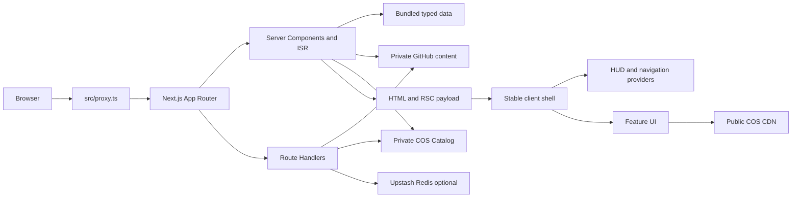

# 系统架构

[返回文档导航](./README.md)

本文描述 ARSVINE REALM 的稳定系统边界、运行拓扑、分层、主要 provider 和数据流。具体操作细节链接到各专题文档。

## 技术基线

- Next.js 16 App Router、React 19、TypeScript。
- `next-intl` 4 与三个 UI locale。
- SCSS Modules + shared partials。
- MDX 通过 `next-mdx-remote` 序列化和渲染。
- Three.js、`@react-three/fiber`、`@react-three/cannon`、`cannon-es`。
- GSAP 与 Web Animations API。
- XState 5 / `@xstate/react` 处理受保护文章状态。
- Vitest + `jsdom`。
- Vercel 为生产平台；`server.js` 只用于本地和可选自托管。

## 系统全景



## 运行拓扑

### Vercel

Vercel 使用标准 Next.js 构建输出：

- `src/proxy.ts` 作为 Proxy；
- `src/app/api/**/route.ts` 作为 Route Handler / Function；
- App Router 页面按 static、ISR 或 dynamic 模式运行；
- 不运行 `server.js`，也不执行 `pnpm start`。

### 本地与自托管

```text
node server.js
  -> load .env chain
  -> next({ dev })
  -> Node HTTP server
  -> Next request handler
```

`pnpm dev` 和 `pnpm start` 都经过 `server.js`。locale 和路由行为仍由 `src/proxy.ts` 与 App Router 控制。

## 分层

### `src/app/`

负责 framework adapter：route params、metadata、layout、SSG/ISR、not-found、Route Handler。页面组件不应承载大型业务状态或外部服务实现。

### `src/features/`

按业务领域组织：

```text
contracts/   数据合约与静态数据
model/       状态、hooks、controller、纯逻辑
server/      server loader、handler、外部数据适配
ui/          React UI
styles/      feature styles
public.ts    可选公共入口
```

并非每个 feature 都必须拥有所有目录。

### `src/shared/`

只存跨 feature 的稳定能力：locale/performance contract、通用 hook、UI primitive、HTTP/revalidation helper、内容安全工具和配置。

单个 feature 消费的算法应留在该 feature 的 `model/`，避免把 `shared` 变成杂物层。

## 全局 shell

`src/app/layout.tsx` 是稳定 document/client-shell boundary，持有：

- client i18n message provider；
- HUD provider；
- navigation/transition provider；
- telemetry boundary；
- `MainLayout`；
- document bootstrap performance/geo attributes。

`src/app/[locale]/layout.tsx` 是 nested server layout，只处理 locale 验证、server-side `next-intl` 和 locale metadata。

详细路由关系见 [`ROUTING_AND_I18N.md`](./ROUTING_AND_I18N.md)。

## 主要状态边界

### HUD

`features/hud/model/HudProvider.tsx` 组合 loading、power/battery、inverted theme、环境 telemetry、typing 和 column interaction。性能能力通过共享 contract 注入，feature 不自行读取粗粒度设备信息决定效果。

### Navigation

`features/navigation/model/TransitionProvider.tsx` 统一处理内部导航动画、URL push、queue、BACK override 和 locale switch。

`LayoutAnchorsContext` 注册真实 scroll container；`LocalePageState` 只保留明确允许的非敏感 locale-independent 页面状态。

### Protected blog

`features/blog/model/blogPostState.ts` 使用 XState invoked actor 管理 grant check、TOTP 后继续加载、variant 切换、错误和请求取消。组件不自行复制异步状态机。

## 数据来源

### Bundled typed data

随构建进入应用，适合站点配置、作品、经历、Life、技能和友链。locale 数据通过静态 registry 选择。

### Private GitHub content

服务端读取 `blog-index.json`、MDX 与 tweet JSON。路径经过严格 repo-relative 校验。未配置时使用可控 fallback。

### COS Catalog

私有 versioned Catalog 把稳定 `catalogKey` 映射到公共 bucket 中不可变 hash object。server loader 在 SSG/ISR 时 hydrate 数据；public site manifest 只提供非敏感 shell 资产。

详见 [`CONTENT_AND_MDX.md`](./CONTENT_AND_MDX.md) 与 [`ASSETS.md`](./ASSETS.md)。

## API 边界

| Route | 方法 | 责任 |
|---|---|---|
| `/api/hitokoto` | GET | timeout/cached 第三方文本代理 |
| `/api/grant-check` | GET | 检查签名访问 Cookie |
| `/api/protected-verify` | POST | 校验 TOTP、限流、设置 Cookie |
| `/api/post-variant` | GET | 按 locale 返回 MDX；protected 需要 grant |
| `/api/tweet-months` | GET | 分页返回 tweet month group |
| `/api/assets/{audio,home,links,works}` | GET | 读取当前 Catalog section |
| `/api/assets/collections/[slug]` | GET | 分页读取 collection |
| `/api/revalidate` | POST | 刷新 tweet 页面 |
| `/api/revalidate-content` | POST | 刷新 content 与可选 blog slug |
| `/api/revalidate-assets` | POST | 刷新 home/content/friends/detail 资产页面 |

Route 文件只适配 Web `Request` / `Response`；业务 handler 位于 feature/server。未导出的方法由 Next.js 返回 `405`。

## Styling 边界

- component 使用 SCSS Module。
- `src/app/styles/globals.scss` 提供颜色、字体、z-index 和 performance attribute token。
- `src/app/styles/Shell.module.scss` 是应用 shell style entry。
- feature section style 留在所属 feature。
- semantic `--z-*` token 是全局 overlay 顺序来源。
- mobile/desktop boundary 为 `767px` / `768px`。

## 性能架构

document bootstrap 只读取 reduced motion 与 Save-Data，生成 hydration-safe 初始 tier。运行时 HUD controller 根据 frame pacing 逐级关闭能力，并把状态写入 `<html data-*>`。

WebGL module 必须允许 lazy load failure、context loss、pause 和能力关闭。Fiber 的 clock 使用仓库 patch 改成 `THREE.Timer` compatibility wrapper。

详见 [`PERFORMANCE.md`](./PERFORMANCE.md)。

## Failure boundary

- GitHub 内容缺失：博客 fallback、推文空状态。
- public site manifest 失败：移除可选装饰，不阻断导航。
- private Catalog 失败：API 返回明确 `502`，server loader 使用定义好的 fallback。
- telemetry provider 失败：error boundary 隔离，不阻断站点。
- Upstash 失败：记录错误并退回本地限流。
- WebGL import/context 失败：关闭对应能力，保留基础 UI。
- protected variant `403`：回到 `authRequired`，不显示缓存外正文。

## 关键不变量

1. 只使用 App Router。
2. Vercel 不运行 `server.js`。
3. 内部导航使用 `navigateTo()`。
4. locale 不由 IP 选择。
5. locale data 使用静态 registry。
6. protected body 不进入静态 payload。
7. invoked actor 保留请求取消语义。
8. WebGL 不在 transition 中反复销毁/重建 context。
9. Catalog pointer 最后切换，public object 使用 immutable hash。
10. Fiber 精确版本与 patch 同步维护。

## 相关文档

- [`ROUTING_AND_I18N.md`](./ROUTING_AND_I18N.md)
- [`CONTENT_AND_MDX.md`](./CONTENT_AND_MDX.md)
- [`SECURITY.md`](./SECURITY.md)
- [`ASSETS.md`](./ASSETS.md)
- [`PERFORMANCE.md`](./PERFORMANCE.md)
