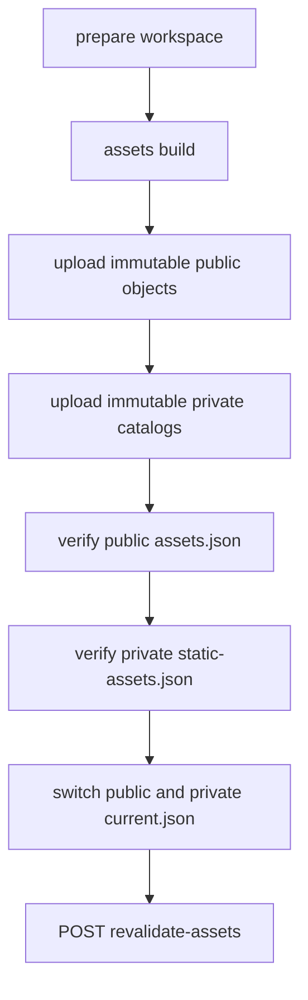

# 资产、Catalog 与 CDN

[返回文档导航](./README.md)

本文说明 `public/` 与 COS 的边界、本地 workspace、Catalog 构建、发布、回滚、CORS/Referer、字体、图片和音频维护。

## 存储边界

| 位置 | 内容 | 规则 |
|---|---|---|
| `public/` | avatar/logo、favicon、PWA icon/manifest、启动关键本地字体 | 小、稳定、首屏必要 |
| public COS | 图片、音频、QR、装饰图、字体、public site manifest | public-read、immutable hash object |
| private COS | versioned Catalog 和 `current.json` | server-only 读取 |
| `cos-workspace/` | 本地 mirror、metadata、coscli | gitignored，不提交 |
| `dist/cos-upload/` | 构建生成的上传树 | 可重建，不手工编辑 |

业务数据保存稳定 `catalogKey`，Catalog 在 SSG/ISR 时将它映射到带 hash 的 `objectKey`。不要把旧 COS prefix 或 hash 直接写入 TypeScript 数据。

## Catalog 布局

```text
public bucket/
  shared/fonts/**
  realm/images/YYYY/MM/DD/<name>.<hash>.<ext>
  realm/audio/YYYY/MM/DD/<name>.<hash>.<ext>
  realm/site-catalog/current.json
  realm/site-catalog/versions/<version>/assets.json

private bucket/
  realm/catalog/current.json
  realm/catalog/versions/<version>/home.json
  realm/catalog/versions/<version>/works.json
  realm/catalog/versions/<version>/collections.json
  realm/catalog/versions/<version>/links.json
  realm/catalog/versions/<version>/audio.json
  realm/catalog/versions/<version>/static-assets.json
```

`current.json` 是可变 pointer；version object 与媒体 object 是不可变的。

## 本地 workspace

默认根目录：

```text
cos-workspace/
  public-root-legacy/     旧 bucket 完整 mirror，供 prepare 输入
  public-root/            规范化公共树
  _meta/realm/            home/works/collections/links/audio metadata
  coscli-windows-amd64.exe
```

`pnpm assets:prepare` 会：

1. 读取 legacy mirror；
2. 迁移到 `realm/` 与 `shared/` canonical prefix；
3. 把 base name 规范成短英文 kebab-case；
4. 重建 `_meta/realm/*.json` 与 legacy asset source map。

参数：

```bash
node scripts/prepare-cos-workspace.mjs --workspace path/to/workspace --date 2026-07-14
```

`--date` 必须为 `YYYY-MM-DD`。

## 构建资产

```bash
pnpm assets:build
```

可选参数：

```bash
pnpm assets:build -- --workspace path/to/workspace --dist path/to/dist
pnpm assets:build -- --publish-current
```

默认生成 `current.next.json`，避免构建动作被误当成发布。`--publish-current` 只影响本地产物文件名，不会上传远程 bucket。

构建会：

- 为图片和音频计算 SHA-256 短 hash；
- 验证文件名、状态、重复 ID、source 引用与 published alt；
- 对超出 EdgeOne 限制的图片执行约束 resize；
- 生成 public/private versioned Catalog；
- 从 allowlist 生成 sanitized public site manifest；
- 写入 `dist/local-manifest/manifest.generated.json`。

输出：

```text
dist/cos-upload/public-root/
dist/cos-upload/private-root/
dist/local-manifest/manifest.generated.json
```

## 发布流程



先 dry-run：

```bash
pnpm assets:publish -- --dry-run
```

真实发布：

```bash
pnpm assets:publish
```

`--force-full` 使用递归 `cp`，默认使用 `sync` 并排除 pointer：

```bash
pnpm assets:publish -- --force-full
```

必需环境变量：

```text
COS_PUBLIC_BUCKET
COS_PUBLIC_REGION
COS_PRIVATE_BUCKET
COS_PRIVATE_REGION
COS_SECRET_ID
COS_SECRET_KEY
NEXT_PUBLIC_SITE_URL
REVALIDATE_SECRET
```

可选：`COS_SESSION_TOKEN`、`COSCLI_PATH`。

发布脚本始终使用 `--init-skip` 和当前进程凭据，不依赖持久化 coscli profile。

## Pointer-last 保证

脚本只有在以下步骤成功后才切换 pointer：

1. public object 上传；
2. private Catalog 上传；
3. public version `assets.json` 可列出；
4. private version `static-assets.json` 可列出。

上传或验证失败不会切换 pointer。revalidation 发生在 pointer 之后；它失败时已渲染页面仍可服务，但新 Catalog 可能要等正常 ISR 或手动重试才完全生效。

## 回滚

```bash
pnpm assets:publish -- --rollback 20260710T120000Z
```

version 必须匹配 `YYYYMMDDTHHMMSSZ`。回滚只把 public/private pointer 指回已存在版本，然后调用 `/api/revalidate-assets`；不会重新上传 object。

回滚前确认两个 bucket 中目标 version 完整存在。

## Runtime fallback

- private Catalog 缺失或无效时，server loader 使用各 feature 定义的 fallback；asset API 对 Catalog failure 返回 `502`。
- public site manifest 缺失时，只移除可选 shell 装饰，不阻断内容和导航。
- `static-assets.json` 解析后才 hydrate 稳定 `catalogKey`；数据文件不感知 hash。

## CORS 与 Referer

public bucket 至少允许 `GET` / `HEAD`：

```text
https://arsvine.com
预期的 *.arsvine.com origin
http://dev.arsvine.com
```

Referer allowlist 与这些 origin 保持一致。CDN 如果缓存 CORS response，cache key 必须包含 `Origin`，或正确遵循 `Vary: Origin`，避免 production response 污染本地 manifest 请求。

本地真实资产调试见 [`GETTING_STARTED.md`](./GETTING_STARTED.md) 的 `dev.arsvine.com` 流程。

## 字体

字体配置来源：

```text
src/shared/config/site.ts -> siteConfig.fonts.googleStylesheet
src/shared/config/site.ts -> siteConfig.fonts.cdnStylesheet
```

刷新 staging：

```bash
node scripts/fetch-google-fonts.mjs
```

配置只读检查：

```bash
pnpm maintenance:check
```

上传 `public/_fonts-staging/` 到 `shared/fonts/`。metadata：

| Object | Content-Type | Cache-Control |
|---|---|---|
| `google-fonts.css` | `text/css; charset=utf-8` | `public, max-age=86400, must-revalidate` |
| `*.woff2` | `font/woff2` | `public, max-age=31536000, immutable` |

COS UI 的 Value 字段只填值，不要重复 `Cache-Control:` header name。

## 图片工具

```bash
node scripts/convert-images.mjs avif --quality 50
node scripts/convert-images.mjs jpg --quality 75 --keep-smaller
node scripts/convert-images.mjs --src path/to/in --out path/to/out --overwrite
```

默认输入 `scripts/images/`，输出 `<src>/out/`，递归处理且不覆盖已有文件。

远程图片 allowlist 位于 `config/image-hosts.js`。大图优先直接走 CDN，避免不必要的 Vercel Image Optimization 配额。

## 音频

生产音频位于 `realm/audio/YYYY/MM/DD/`，playlist 来自 private Catalog。仓库中没有生产/离线 `public/music/` fallback。避免 autoplay loop、重复下载和提交私有音频。

## 发布验收

- public/private version 文件存在。
- 两个 `current.json` 指向同一 version。
- Catalog 中每个 `objectKey` 可访问。
- public manifest 不含 private metadata。
- `/api/revalidate-assets` 没有 failed path。
- home、content、friends、web/life detail 显示新资产。
- CORS、Referer、font Content-Type 与 Cache-Control 正确。
- 验证完成前不删除旧 prefix 或旧 version。

## 相关文档

- [`CONFIGURATION.md`](./CONFIGURATION.md)
- [`OPERATIONS.md`](./OPERATIONS.md)
- [`TROUBLESHOOTING.md`](./TROUBLESHOOTING.md)
