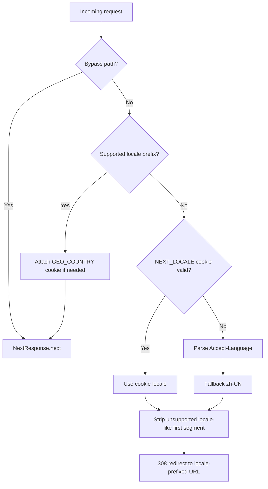

# 路由与国际化

[返回文档导航](./README.md)

本文说明 App Router 路由、locale 解析、全局 layout、页面过渡、hash 导航和 locale 切换时的状态保留。

## Locale 合约

UI locale 的唯一来源是 `src/shared/contracts/locale.ts`：

```ts
export const locales = ['zh-CN', 'zh-TW', 'en'] as const;
export const defaultLocale = 'zh-CN';
```

同一文件还维护 `htmlLangMap`、`ogLocaleMap`、`rssLanguageMap`、短标签和原生名称。不要在其他模块复制 locale 数组。

## 公共路由

| 路由 | 作用 |
|---|---|
| `/[locale]` | HUD 首页 |
| `/[locale]/content` | 带 `#works`、`#experience`、`#blog`、`#life` 等 section 的聚合页 |
| `/[locale]/{works,experience,life,friends,about,contact,tweets,copyright}` | section 或独立页 |
| `/[locale]/blog/[slug]` | 博客详情，SSG + ISR |
| `/[locale]/web/[id]` | 项目详情 |
| `/[locale]/life/[slug]` | Life 详情 |
| `/[locale]/access/[group]` | 独立 TOTP gate |
| `/[locale]/rss.xml` | locale RSS |
| `/rss.xml` | RSS 入口 |
| `/sitemap.xml` | 动态 sitemap |
| `/robots.txt` | 动态 robots |

`/[locale]/game` 不是有效路由。游戏项目在 content hub 的详情模式中展示。

## Proxy locale 解析

`src/proxy.ts` 是 Next.js 16 的 Proxy convention。它跳过 API、Next/Vercel internals、常见静态前缀和带扩展名的文件。



语言选择顺序固定为：

```text
NEXT_LOCALE Cookie > Accept-Language > zh-CN
```

不要使用 IP country 选择语言。

## GEO_COUNTRY 的边界

Proxy 可以通过 Vercel geolocation、`?_geo=XX` 调试覆盖或已有 Cookie 得到二字 country，并写入 `GEO_COUNTRY` Cookie。它只用于客户端 UI 微调：

- 不参与 locale 选择。
- 不参与认证、授权或安全决策。
- 不注入共享 SSG/ISR server payload，避免首个访问者污染 CDN cache。
- `?_geo=` 清除覆盖；无效覆盖不会成为可信输入。

## Layout 层级

```text
src/app/layout.tsx
  document + client i18n + global providers + HUD + MainLayout
  src/app/[locale]/layout.tsx
    locale validation + server next-intl + locale metadata
    page.tsx / nested routes
```

全局 shell 必须位于 locale segment 之上。否则 locale 跳转会 remount 全局 provider，重置音乐、HUD、WebGL、drawer 和 transition state。

## 内部导航

内部导航统一使用：

```ts
const { navigateTo } = useTransition();
navigateTo('/zh-CN/content#blog');
```

`TransitionProvider` 先通过 `resolveNavigationTransitionPlan()` 选择策略，再执行动画和 push。主要计划包括：

- home forward（mobile/desktop）
- cross-page hash
- return home（mobile/desktop）
- blog detail fade
- standard slide
- same-page hash

直接调用 `router.push()` 会绕过 column retract/expand、detail fade 和 loading choreography。

## Locale 切换

UI locale 切换使用：

```ts
useTransition().switchLocale(nextLocale)
```

它只替换 URL 的 locale segment，不运行普通页面退出动画。`LocalePageState` 可以保留明确注册且不敏感的页面状态，但只在 locale-independent route 相同的情况下生效。

不得保留：

- TOTP 输入；
- 认证或授权结果；
- pending mutation；
- error object；
- 任何 secret 或用户敏感内容。

## Hash 导航

布局不是普通 document scroll；`LayoutAnchorsContext` 注册真实 scroll container。content hash 导航必须同时处理：

1. URL section 解析；
2. 同页或跨页 transition；
3. 目标 section 挂载；
4. scroll container 对齐；
5. 动画 reveal；
6. URL/hash 同步。

移动端目标 section 使用：

```scss
scroll-margin-top: var(--mobile-section-scroll-offset);
```

不要增加独立 JavaScript offset helper。

## Loading overlay

`useRouteLoadingKind()` 根据离开的 source pathname 选择 overlay，而不是目标 URL：

- home/content → blog detail：左面板仍可见，使用 default/right overlay。
- blog detail → blog detail：左面板已隐藏，使用 standalone overlay。

将判断改成 target-based 会破坏其中一个方向。

## Not Found

- locale segment 内使用 `src/app/[locale]/not-found.tsx`。
- 未匹配的 locale 路径由 `[...missing]` route 处理。
- Proxy 会剥离类似 `/fr/...` 的不支持 locale segment，避免形成 `/en/fr/...`。

## 新增路由检查清单

1. 在 `src/app/[locale]/` 下创建 App Router route。
2. 保持 page 为 server adapter，业务 UI 放 feature。
3. 更新 sitemap/RSS/metadata（如适用）。
4. 使用 `navigateTo()` 接入内部入口。
5. 判断是否需要 content hash、loading overlay 或 back override。
6. 增加 route contract 和交互测试。
7. 验证三个 UI locale 的直接 URL。

## 相关文档

- [`ARCHITECTURE.md`](./ARCHITECTURE.md)
- [`CONTENT_AND_MDX.md`](./CONTENT_AND_MDX.md)
- [`GOTCHAS.md`](./GOTCHAS.md)
