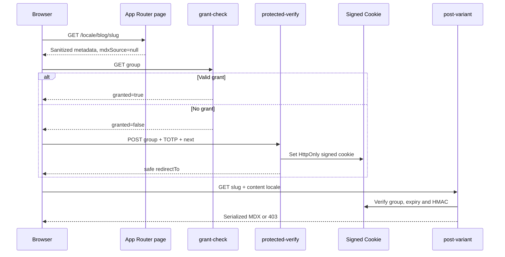

# 安全与受保护内容

[返回文档导航](./README.md)

本文说明受保护文章、TOTP、签名 Cookie、限流、可信代理、GitHub 内容路径、外链和内部重定向的安全边界。

## 威胁模型

需要防止：

- protected MDX 在授权前进入 HTML、RSC 或静态数据；
- 伪造或过期访问 Cookie；
- TOTP 暴力尝试；
- 通过转发头绕过限流；
- GitHub Contents API 路径穿越或请求任意 URL；
- `javascript:` / `data:` 外链 XSS；
- 未验证 slug 或 locale 进入内部导航；
- revalidation endpoint 被未授权调用。

## Protected post 流程



核心不变量：protected body 在授权前不存在于页面静态输出中。

## TOTP 配置

```env
ACCESS_GRANT_SECRET=<long-random-string>
TOTP_GROUPS_JSON={"friends-a":{"current":"REPLACE_ME","period":30,"digits":6,"window":1}}
```

group 支持：

- `current`：当前 secret；
- `previous`：可选旧 secret 列表，用于轮换窗口；
- `period`：可选时间步长；
- `digits`：可选验证码位数；
- `window`：可选前后时间窗口。

Secret 必须只存在于服务端环境。不要写入内容仓库、客户端变量、日志、文档示例或截图。

## 访问 Cookie

Cookie 名为 `arsvine_post_access`，payload 包含 group、expiry 和 HMAC signature。默认 TTL 为 1 小时。

属性：

```text
Path=/
HttpOnly
SameSite=Lax
Max-Age=3600
Secure              仅 production
```

服务端使用 `timingSafeEqual` 校验签名，并同时验证 group 与 expiry。Cookie 是访问 grant，不包含文章正文。

## XState 取消语义

grant check 和 variant load 必须保留在 `blogPostState.ts` 的 invoked actor 中。离开 `authChecking` 或 `loadingVariant` 时，XState 通过 `AbortSignal` 取消旧请求。

`ARTICLE_CHANGED` 必须：

- `reenter: true`；
- 完整替换 article context；
- 重置错误；
- 重新计算 `authState`；
- 恢复新文章的 `displayedContentLocale`。

不要加入按 slug/locale request key 的去重 ref。首次 effect 可以通过完整 memoized input identity 跳过，但后续真实输入变化必须进入 actor cancellation 流程。

## 限流

`/api/protected-verify` 使用 client + group key，当前限制为每分钟 5 次。revalidation endpoint 也有独立限流。

优先使用 Upstash Redis：

```env
UPSTASH_REDIS_REST_URL=...
UPSTASH_REDIS_REST_TOKEN=...
```

没有 Redis 或 Redis 失败时，系统 fail-open 到进程内 fixed-window `Map`，同时记录错误。该 fallback 不具备 serverless 多实例一致性。

## 客户端地址与可信代理

- Vercel：`VERCEL=1` 时信任平台管理的 forwarding header。
- 自托管：只有可信反向代理会覆盖来访者 header 时才设置 `TRUST_PROXY=1`。
- 直接暴露：不要设置 `TRUST_PROXY`，否则攻击者可能伪造 IP key。

## GitHub 内容路径

传给 GitHub Contents API 的路径必须是 repo-relative：

- 拒绝绝对 URL 和 `//host/path`；
- 拒绝 leading `/`、反斜杠、query、fragment；
- 拒绝 traversal 和 encoded traversal；
- 按 segment 编码；
- 最终 URL 从固定 GitHub API base 构建。

不要把用户字符串直接拼进 API URL。

## 外链与 MDX 链接

作品外链通过 `new URL()` 解析，只允许指定 protocol，并按解析后的 hostname 区分 GitHub/Bilibili variant。不要使用 `includes('github.com')`。

MDX 链接使用专用规则：允许安全绝对 URL、`mailto:`、relative path 和 fragment；危险或协议相对输入降级为纯文本。

## 内部导航与 redirect

- Blog slug 只允许单个安全 segment。
- locale 必须来自合约 allowlist。
- 不安全的相邻文章目标退回 `/${locale}/content#blog`。
- `protected-verify` 的 `next` 必须通过 `normalizeNextPath()`，拒绝外部和 protocol-relative redirect。

## Revalidation 认证

所有 revalidation handler 使用 `REVALIDATE_SECRET`。未配置或不匹配时必须拒绝。不要在 URL、客户端 bundle 或日志中暴露 secret。

## 安全验证清单

1. 未授权访问 protected page 时 HTML/RSC 不含 body。
2. 未授权 `/api/post-variant` 返回 `403`。
3. 错误 TOTP 触发结构化错误与限流。
4. 正确 TOTP 设置 HttpOnly Cookie，随后正文可加载。
5. 过期、错误 group 或篡改 Cookie 无效。
6. unsafe GitHub path、external redirect 和 dangerous link 被拒绝。
7. revalidation 无 secret 时拒绝。
8. 生产 Cookie 包含 `Secure`。

相关测试集中在：

```text
tests/features/blog/
tests/shared/lib/content/
tests/shared/lib/safe-external-href.test.ts
tests/features/blog/mdx-href.test.ts
```

## 相关文档

- [`CONTENT_AND_MDX.md`](./CONTENT_AND_MDX.md)
- [`CONFIGURATION.md`](./CONFIGURATION.md)
- [`GOTCHAS.md`](./GOTCHAS.md)
